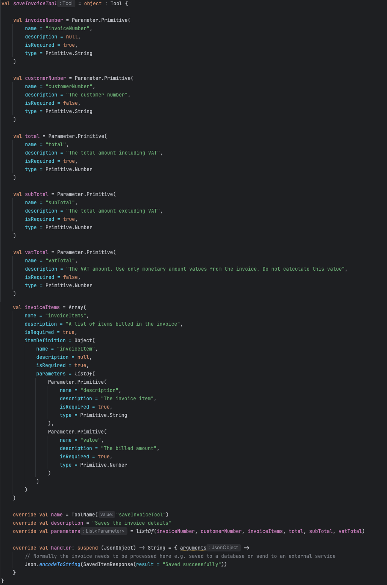
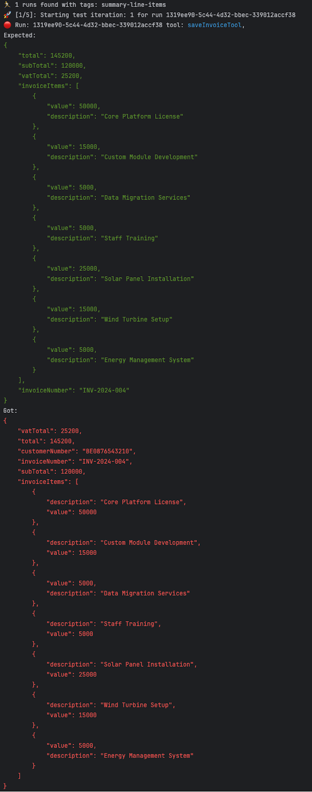

# Bridging the Gap: From LLM Proof of Concept to Production

## Introduction

Imagine this: You've just unveiled your AI application powered by a Large Language Model (LLM). The demo wows everyone, and you're riding high on success. Then reality hits. As real-world documents start flowing through your app, edge cases emerge, exposing gaps between your carefully crafted proof of concept and the demands of a production environment.

Sound familiar? You're not alone. In the fast-paced world of AI development, bridging the chasm between a promising demo and a robust, production-ready application is a challenge that plagues everybody. This gap often leads to stalled projects, missed opportunities, and frustrated stakeholders.

Enter Aigentic - a comprehensive platform designed to transform your LLM application journey from proof of concept to production. In this post, we'll explore how Aigentic empowers developers to tackle real-world challenges, ensuring your AI applications don't just impress in the demo room, but deliver consistent value in the wild.

Let's look at this challenge through a real-world example.

<!-- truncate -->

## Case Study: Invoice Processing Agent

We've created an LLM-powered agent to handle PDF invoices. The agent's job is to pull out key information like invoice numbers, customer numbers, items, and amounts. 

Here's a simple version of our agent, made using Aigentic:

The agent has access to a tool called "saveInvoiceTotal". The agent can use this tool to interact with the "real-world", in this case by for example saving the invoice information to a database or sending it to an external service.

Our first tests with sample invoices look good.However, when we implement it in a real-world scenario, we hit a problem. Some invoices have summary rows that add up other items. We don't want these summary rows saved as separate items, as it would make our total amounts wrong:

‍

In the screenshot above we can see that 2 lines: "Smart City Platform Implementation" and "Renewable Energy Integration Services" are included as invoice items, this is not what we want.

To prevent this issue from occurring an extra instruction could be added: "If the line items are summarized, please provide only the details of the invoice items". But how can we quickly test if this works? And how do we know if invoices that were already processed correctly are still being processed correctly? We want to prevent invoice lines from suddenly missing later because the agent starts seeing them unintentionally as summary lines.

## Enter Aigentic platform…

Because we've configured the Aigentic platform in our agent, all our runs are recorded in this platform. This provides us with the opportunity to replay these runs in a sandbox environment within Aigentic. We can now validate whether our adjustment is sufficient AND that our earlier invoices are still being processed correctly. Since the test runs completely isolated and the "saveInvoiceTool" isn't actually called in the test, we can iterate as many times as needed until it works, without the invoice being processed multiple times through our application. We're essentially testing with production data without altering our production environment.

This approach allows us to measure the effect of our adjustments and provides a quick feedback cycle. As a result:

- We don't have to guess whether our changes work and don't have unintended side effects that might cause invoices that previously worked to suddenly stop working.
- We don't have to wait until another "summary invoice" comes through production to see if our adjustments work (with the risk that the adjustment isn't sufficient, and we'd have to wait again before we can make another attempt).

In summary: We can shorten the feedback loop and quantify that our adjustments work.

Here's how it works: in Aigentic platform, we can tag runs that went well, which can be used for validation. We also tag the run with the edge case and indicate what output we actually expect. Now we can make the adjustment and immediately test in an isolated environment whether the output meets our expectations.

To indicate which arguments we actually expect in the tool call, the recorded tool call can be copied from Aigentic platform to the test:

Then we paste this into the regression test DSL and remove the invoice lines (the summary lines) that we don't expect ("Smart City Platform Implementation" and "Renewable Energy Integration Services"):

We've specified that the test should repeat for 5 iterations, allowing us to directly validate that the invoice details are consistently recognized. This is useful because LLMs aren't 100% deterministic by nature. 

Now before we add the extra "If the line items are summarized, please provide only the details of the invoice items" instruction the test should fail:

The test fails as expected. Note that it fails because of the 2 extra invoiceItems, the order of properties is also different but this doesn't affect the outcome. Now the test is setup correctly and we're able to reproduce the problem let's add the extra instruction to the agent:

After running the test again we now see that the LLM succeeds in recognizing the expected invoice items, and it's consistent too:

We now see that the adjustment works as intended. Next, we want to know if our adjustment hasn't led to invoices that were previously processed correctly suddenly producing errors. For this, the regressionTest DSL can be used again and we can test with the runs we've approved and tagged as "validated" to see if they're still executed in the same way. Aigentic compares whether the test run results match with the previously recorded production run. Since these were already correct, it's not necessary to override these "expectations" as was the case with the correction.

As can be seen in the test result, the extra instruction to ignore "summary lines" hasn't produced any undesired side effects. Each run has been successfully tested 5 times here as well. Invoices that were previously processed correctly are still processed in exactly the same way with the adjustment.

With this, we've validated that:

- The adjustment works as expected; summary lines are no longer extracted.
- No regression has occurred; historical production runs are still processed in the same way.
- The agent delivers consistent results; for each invoice, 5x the same input yields 5x the same output.

## Conclusion

Throughout this post, we've explored the challenges that arise when moving LLM applications from proof of concept to production. As demonstrated by our invoice processing example, issues like edge cases and inconsistent outputs can quickly complicate what seemed like a straightforward project.

We've seen how a platform like Aigentic can help address these challenges by:

1. Facilitating the identification and isolation of edge cases
2. Enabling adjustments in a controlled environment
3. Supporting validation against both new and historical data
4. Ensuring consistency across multiple runs

The ability to shorten feedback loops and quantify the impact of adjustments can significantly streamline the development process for LLM applications. This approach allows teams to tackle real-world challenges more effectively, leading to faster development cycles and more reliable outcomes.

As AI and LLM technologies continue to evolve, tools that bridge the gap between concept and production will likely play an increasingly important role in the development process. By addressing the practical challenges of LLM application development.

For those interested in exploring this approach further, more information about Aigentic is available at [https://aigentic.io](https://aigentic.io).
